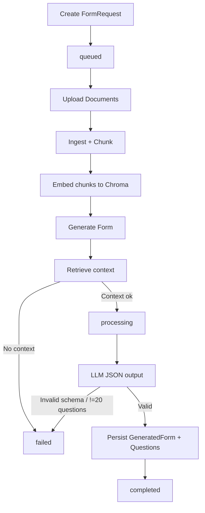

# RAG Logic Manual (Backend + API)

This document explains the new RAG logic end-to-end so you can quickly understand what happens, where it happens, and why.

---

## 1) Goal of the module

The RAG module builds dynamic assessment forms from user-uploaded documents.

Pipeline:
1. User creates a `FormRequest` (difficulty + evaluation type).
2. User uploads 3–4 source documents.
3. Backend extracts text, chunks it, and embeds chunks into Chroma.
4. Retrieval pulls the most relevant chunks for the request.
5. Generation asks the LLM to return **exactly 20 questions** in strict JSON.
6. Backend validates and persists the generated form/questions.

---

## 2) Main domain objects

Defined in `apps/rag/models.py`:

- `FormRequest`
  - Owner (`user`), `difficulty`, `evaluation_type`, `status` (`queued`, `processing`, `completed`, `failed`), `created_at`.
- `Document`
  - Uploaded file metadata tied to a `FormRequest`.
- `DocumentChunk`
  - Text chunks per document with `chunk_index`, `metadata`, optional `embedding_id`.
- `GeneratedForm`
  - Final generated questionnaire container.
- `Question`
  - Each generated question, choices, answer, explanation, source references.
- `Submission`
  - User answers + score for a generated form.

---

## 3) API surface and routing

Root wiring:
- `backend/urls.py` mounts RAG API at `api/rag/`.

Router wiring:
- `apps/rag/api/urls.py`
  - `form-requests`
  - `forms`
  - `submissions`

Primary `FormRequest` actions (`apps/rag/api/views.py`):
- `POST /api/rag/form-requests/`
  - Create request. `user` is assigned server-side in `perform_create`.
- `POST /api/rag/form-requests/{id}/upload_documents/`
  - Upload files under `documents` multipart field.
- `POST /api/rag/form-requests/{id}/generate_form/`
  - Retrieve context + generate/persist form/questions.
- `GET /api/rag/form-requests/{id}/status/`
  - Poll request status.

Read-only retrieval:
- `GET /api/rag/forms/`
  - Returns generated forms for the authenticated user.

---

## 4) Request lifecycle + status transitions

`FormRequest.status` state changes:

- On create: `queued` (default).
- During generation: set to `processing`.
- On successful generation: set to `completed`.
- On retrieval failure / validation failure / generation error: set to `failed`.



---

## 5) Ingestion internals

Implementation: `apps/rag/services/ingestion_service.py`

`IngestionService.validate_and_store(files, form_request)` does:

1. Saves uploaded files to:
   - `MEDIA_ROOT/rag_sources/{form_request.id}/`
2. Computes:
   - size, SHA-256 checksum.
3. Tries PDF page count using `PyPDF2`.
4. Creates `Document` DB row.
5. Extracts text (`.txt`, `.md`, `.pdf`; unsupported types -> empty text).
6. Chunks extracted text using `ChunkingService`.
7. Creates `DocumentChunk` rows with metadata:
   - `source`, `chunk_index`, `document_id`.
8. Triggers embedding task (`embed_form_chunks`) asynchronously if Celery is available; otherwise sync fallback.

Important behavior:
- Embedding failures do **not** block ingestion.

---

## 6) Chunking strategy

Implementation: `apps/rag/services/chunking_service.py`

- Character-based chunking.
- Defaults:
  - chunk size = `2000` chars
  - overlap = `200` chars
- Returns ordered list of `(index, chunk_text)`.

This is a simple and deterministic baseline chunker.

---

## 7) Embedding + vector storage

Implementation: `apps/rag/services/embedding_service.py`

- Embedding model:
  - `HuggingFaceBgeEmbeddings` using `EMBED_MODEL` setting (default `BAAI/bge-base-en-v1.5`).
- Vector DB:
  - `Chroma` persisted in `VECTOR_STORE`.
- Collection model:
  - per-form-request collection (`form_{id}`) to isolate user/form data.
- Metadata enrichment per chunk includes:
  - `document_chunk_id`, `document_id`, `chunk_index`, plus source metadata.

If embedder initialization fails, generation path will fail later because embeddings cannot be queried.

---

## 8) Background embedding (Celery)

Implementation: `apps/rag/tasks/ingest_tasks.py`

Task: `rag.embed_form_chunks`
- Loads all chunks for the target form request.
- Calls `EmbeddingService.embed_chunks(...)`.
- Returns status payload (`ok`, `no_chunks`, or `error`).

If Celery app is unavailable, the same function name exists as a sync fallback.

---

## 9) Retrieval logic

Implementation: `apps/rag/services/retrieval_service.py`

`retrieve(form_request, top_k=10, use_mmr=True)`:

1. Builds query from request profile:
   - `"{evaluation_type} {difficulty} questions from the uploaded documents"`
2. Loads Chroma collection `form_{form_request.id}`.
3. Retrieval order:
   - Try MMR first (`max_marginal_relevance_search`).
   - If that fails/empty, fallback to similarity search with scores.
4. Returns normalized chunk payload list:
   - `text`, `source`, `chunk_index`, `document_id`, `document_chunk_id`, `source_ref`, optional `score`.

If retrieval returns empty list, API responds with insufficient context and marks request failed.

---

## 10) Generation logic + strict schema

Implementation: `apps/rag/services/generation_service.py`
Prompt: `apps/rag/prompts/form_generation_prompt.py`

Flow:
1. Build `system_prompt` from template with difficulty/evaluation_type.
2. Build user context prompt from retrieved chunks:
   - format `[source_ref] chunk_text` per chunk.
3. Call LLM (`forms.llm_config.LLM.complete(...)`).
4. Parse JSON output (supports optional ```json fences).
5. Validate payload:
   - Must be JSON object.
   - If `{"error": ...}` exists, fail.
   - Must contain `questions` list of **exactly 20** items.
6. Persist:
   - `GeneratedForm` + each `Question` via `FormRepository`.

Validation failures raise `ValueError` and become HTTP 400 in the API.

---

## 11) Persistence layer helpers

`apps/rag/repositories/form_repo.py`
- `save_generated_form(...)`
- `save_question(...)`

`apps/rag/repositories/document_repo.py`
- helper methods for document/chunk persistence (currently not the primary path for ingestion, but available for cleaner abstractions).

---

## 12) Auth and permissions behavior

Settings: `backend/settings.py`

- DRF auth classes:
  - `backend.clerk_auth.ClerkJWTAuthentication`
  - session auth fallback.
- Default permissions:
  - `IsAuthenticatedOrReadOnly`.
- Viewset querysets are user-scoped in code (`get_queryset`).
- `FormRequestSerializer` marks `user`, `status`, `created_at` as read-only so the backend controls those fields.

---

## 13) Error handling behavior (important)

`upload_documents`:
- Missing files -> HTTP 400.
- Save/ingestion exception -> HTTP 500.

`generate_form`:
- No uploaded docs -> HTTP 400.
- No retrieval context -> set `failed`, HTTP 400.
- Generation schema/value errors -> set `failed`, HTTP 400.
- Unexpected runtime errors -> set `failed`, HTTP 500.
- Success -> set `completed`, HTTP 201 with generated form/questions.

---

## 14) Configuration keys you should know

From `backend/settings.py`:

- `SOURCE_DATA` (default `/PDF Files`)
- `EMBED_MODEL` (default `BAAI/bge-base-en-v1.5`)
- `VECTOR_STORE` (default `/vectorstore`)
- `GITHUB_TOKEN` (used by LLM client)
- `CELERY_BROKER_URL` / `CELERY_RESULT_BACKEND`
- Clerk settings:
  - `CLERK_JWKS_URL`, `CLERK_ISSUER`, `CLERK_AUDIENCE`

---

## 15) What is synchronous vs asynchronous today

Synchronous now:
- file save
- text extraction
- chunk creation

Async (when Celery available):
- embedding persistence to Chroma

Sync fallback exists for embedding task to keep local dev functional when Celery is not running.

---

## 16) Quick mental model (one-liner)

**Upload docs -> extract/chunk -> embed into per-form vector collection -> retrieve relevant chunks -> force LLM to output strict 20-question JSON -> validate -> persist -> expose via API.**

---

## 17) Current known constraints

- Chunking is character-based, not semantic/sentence-aware.
- No endpoint-specific throttling/rate limiting yet on generation.
- If embeddings are not ready/populated, retrieval may return insufficient context.
- CKEditor warning in system checks is unrelated to RAG but present globally.

---

## 18) Suggested next hardening steps (optional)

1. Add DRF throttles for `generate_form`.
2. Add retries + dead-letter/monitoring for Celery embedding failures.
3. Add readiness checks before generation (ensure chunk/embedding availability).
4. Move extraction/chunking to async workers for large files.
5. Add schema contract tests that assert exact 20-question persistence in integration scenarios.
